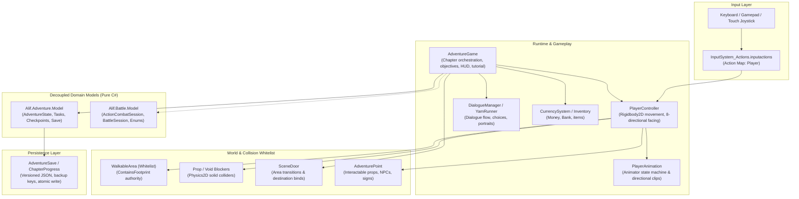

# Alif Architecture and System Guidelines

Alif is a 2D pixel-art educational adventure and combat game built in **Unity 6000.6.0f1 (URP)** using the new **Input System**, **uGUI / TextMeshPro**, **Yarn Spinner**, **UniTask**, **LitMotion**, and **Unity Test Framework**.

---

## 1. High-Level Architecture



---

## 2. Decoupled Assembly Definitions (`.asmdef`)

Alif enforces modular boundaries through Assembly Definitions to ensure lightning-fast incremental compilation and testability:

| Assembly | Dependencies | Purpose |
|---|---|---|
| **`Alif.Adventure.Model`** | None (Pure C#) | Campaign states, task progress, puzzle definitions, and save format. Tested in sub-second time without booting Unity. |
| **`Alif.Battle.Model`** | None (Pure C#) | Turn-based and real-time action combat calculations, combo decay, dodge immunity windows, damage resolution. |
| **`Alif.Runtime`** | `Alif.Adventure.Model`, `Alif.Battle.Model`, `Unity.InputSystem`, `Unity.TextMeshPro`, `dev.yarnspinner.unity`, `UniTask`, `LitMotion` | Core MonoBehaviours, Player, UI, camera, audio, and scene orchestration. |
| **`Assembly-CSharp-Editor`** | `Alif.Runtime`, `UnityEditor` | Procedural level builders, asset postprocessors, and validation linters. |
| **`Alif.Adventure.Tests`** | `Alif.Runtime`, `Alif.Adventure.Model`, `NUnit` | EditMode tests for controls, checkpoints, and collision integrity. |
| **`Alif.Battle.Tests`** | `Alif.Battle.Model`, `NUnit` | EditMode tests for combat mechanics and encounter logic. |
| **`Alif.PlayMode.Tests`** | `Alif.Runtime`, `Unity.InputSystem.TestFramework` | End-to-end smoke tests for complete chapter flows. |

---

## 3. World & Collision Rules

To prevent player snagging and broken routes:
1. **Floor Whitelist Authority (`WalkableArea`)**:
   - Every walkable room consists of explicit rectangular `WalkableArea` boxes.
   - Ambang pintu (doorways) between rooms MUST overlap by at least `0.2f` units.
   - The player's feet must always satisfy `ContainsFootprint` inside a `WalkableArea`.
2. **Solid Blocker Placement (`PropBlockers`)**:
   - Props standing on the floor use small "feet colliders" (thin solid box/capsule at ground level) rather than full-body colliders.
   - Interactable triggers (`AdventurePoint`) must be reachable from at least one adjacent angle. Never let a blocker surround a trigger completely.
3. **Idempotent Level Builders**:
   - Level generation in `AlifDemoSceneBuilder` and `AlifAdventureBuilder` is authoritative and idempotent.
   - Rebuilding clears existing blockers/whitelists and reconstructs them cleanly from specification tables.

---

## 4. Narrative & Dialogue (Yarn Spinner)

- Narrative scripts reside in `Assets/Dialogue/*.yarn`.
- Dialogue logic is separated from C# code. Branching choices, character emotes, and story variables are authored in plain text:
  ```text
  title: BuSiti_Intro
  ---
  Bu Siti: Selamat datang di Warung, Alif!
  -> Ada yang bisa saya bantu?
      <<jump Quest_BuSiti>>
  -> Saya hanya lewat.
      Bu Siti: Hati-hati di jalan ya!
  ===
  ```

---

## 5. Development Velocity & Tooling

Use `./Tools/alif` for all development operations:

```bash
./Tools/alif status          # Inspect pipeline and environment
./Tools/alif validate        # Run campaign validation and configure build scenes
./Tools/alif test-edit       # Run all EditMode tests
./Tools/alif test-play       # Run PlayMode integration tests
./Tools/alif build-web       # Build optimized WebGL player
./Tools/alif build-mac       # Build macOS standalone app
```
